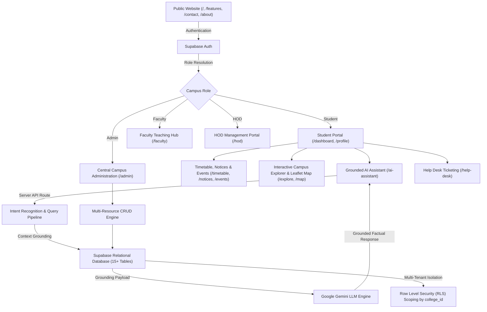

# 🎓 CampusLens AI — Smart College Connect Platform

[](https://nextjs.org/)
[](https://www.typescriptlang.org/)
[](https://supabase.com/)
[](https://tailwindcss.com/)
[](https://leafletjs.com/)

**CampusLens AI** is an institutional-grade, multi-role college connect platform built to unify campus operations, academic schedules, geospatial navigation, issue resolution, and AI assistance into a single collaborative workspace.

---

## 🏛️ System Architecture & Multi-Tenant Scoping



---

## 🚀 Key Modules & Capabilities

### 1. 🎓 Student Experience & Digital ID
- **Personalized Daily Schedule**: Automatically filtered by student's enrolled department, academic year, and division.
- **Holographic Digital Student ID**: Active status pulse, QR verification badge, institutional barcode, roll number, and enrolled division.
- **One-Tap Quick Actions**: Instant access to classrooms, lecture halls, urgent circulars, and campus facilities.

### 2. 🗺️ Geospatial Campus Navigation
- **Interactive Leaflet Map**: OpenStreetMap tiles with custom SVG category pins (Academic, Labs, Libraries, Auditoriums, Cafeterias, Sports).
- **Smooth Geospatial Fly-To**: Selecting any campus space smoothly flies the map camera to its exact GPS coordinates.
- **Accessibility & Hours Filtering**: Filter for wheelchair-accessible facilities, open-now timings, and building floor breakdowns.

### 3. 🤖 CampusLens AI Assistant
- **Zero-Hallucination Factual Answers**: Student queries about room numbers, exam dates, timetable slots, and faculty office hours are resolved directly from database tables.
- **Multi-Turn Chat Interface**: Conversational history memory, suggested prompt chips, and instant contextual queries.

### 4. 📅 Academics, Notices & Events
- **Full-Spectrum Timetable**: Filter lectures by day of the week, department, year, and division.
- **Priority-Ranked Notices**: Urgent administrative announcements, departmental advisories, and exam alerts.
- **Campus Events Calendar**: Live calendar of technical fests, hackathons, and guest lectures with venue links.

### 5. 🎫 Multi-Tier Student Help Desk
- **Categorized Ticket Generation**: Submit tickets for IT & Network, RFID Systems, Lab Hardware, Examinations, or Hostel Amenities.
- **Status Progression Lifecycle**: `Submitted` ➔ `Under Review` ➔ `In Progress` ➔ `Resolved`.
- **Administrative Conversation Thread**: Back-and-forth resolution dialogue between student and administrative coordinators.

### 6. 👨‍🏫 Faculty Hub & HOD Analytics
- **Dual-Mode Teaching Hub**: Real-time view of today's assigned lectures and one-click circular publishing.
- **Department Leadership (HOD)**: Department health indicators, faculty workload distributions, student intake metrics, and syllabus tracking.

### 7. 🛡️ Central Campus Administration
- **10-Domain CRUD Engine**: Create, read, update, and manage records for Students, Faculty, HODs, Departments, Locations, Timetable, Notices, Events, Facilities, and Help Desk.
- **Real-Time Telemetry Cards**: Overview of total enrolled scholars, active instructors, spaces mapped, and pending tickets.

### 8. ⚡ Productivity & Power Features
- **Global Command Palette (`⌘K` / `Ctrl+K`)**: Instant fuzzy search across lecture rooms, faculty directories, events, and navigation links.
- **Universal Bookmarks (`/bookmarks`)**: Save frequently visited locations, important exam circulars, and faculty contacts.
- **Real-Time Notification Bell**: Unread indicator and quick-action notification feed.

### 9. ⚡ Real-Time Websockets & Emergency Broadcasts (Phase 16)
- **Supabase Realtime Channel & Cross-Tab Bus**: Subscriptions across `help_request_replies`, `notices`, and `notifications` with `BroadcastChannel` local event bus fallback.
- **Campus Emergency Broadcast Banner**: Critical, warning, and informational institutional alerts with animated pulse cues and dismissibility.
- **Web Audio API Synthesized Chimes**: Built-in dual-tone audio alert cues without external sound assets and user mute/unmute control.
- **Live Ticket Messaging Thread**: Instant message synchronization and built-in staff technician reply simulator.
- **Administrative Incident Dispatcher**: 1-click preset incident templates for severe weather, electrical maintenance, or tech fests.

### 10. 📱 Progressive Web App (PWA) & Offline Capabilities
- **Installable Web App**: Standard Manifest V3 schema (`/manifest.json`) with app shortcuts and standalone display mode.
- **Service Worker Cache**: Offline-first caching for dashboard, navigation shell, and core application assets.

---

## 🛠️ Technology Stack

| Layer | Technologies |
|---|---|
| **Framework** | Next.js 16 (App Router, Turbopack, Server & Client Components) |
| **Language** | TypeScript 5 (Strict Mode, End-to-End Type Safety) |
| **Styling** | Tailwind CSS v4, Lucide Icons, Glassmorphism UI tokens |
| **UI Components** | shadcn/ui (Radix Primitives, Sheet, Dialog, Card, Badge, Button) |
| **Database & Auth** | Supabase (PostgreSQL 15+, Row-Level Security, Auth Cookies) |
| **Geospatial** | Leaflet, React-Leaflet, OpenStreetMap Cartography |
| **AI Intelligence** | Google Gemini Generative AI, Intent Recognition Pipeline |

---

## 🗄️ Database Architecture

The system utilizes 15 relational tables scoped to `college_id` for multi-college tenant isolation:

- `colleges`: Multi-campus institutional tenant definitions
- `profiles`: Role-based user profiles (`student`, `faculty`, `hod`, `admin`)
- `departments`: Academic faculties, codes, HOD references, and intake capacities
- `faculty`: Academic designations, department mappings, office locations, and emails
- `locations`: Physical campus spaces with latitude, longitude, building, floor, category, and amenities
- `timetable`: Weekly lecture blocks mapped to departments, rooms, faculty, and academic divisions
- `notices`: Institutional and departmental notices with urgency ranking (`normal`, `important`, `urgent`)
- `events`: College conferences, cultural festivals, and seminars
- `facilities`: Campus amenities (Wi-Fi, cafeteria, study pods, sports arenas)
- `help_requests`: Multi-tier support tickets with priority and resolution tracking
- `help_request_messages`: Threaded conversation messages for ticket resolution
- `notifications`: User notification delivery ledger with read/unread flags
- `bookmarks`: Saved user entities (locations, notices, faculty)
- `ai_conversations`: Multi-turn conversational sessions
- `ai_messages`: User prompts and grounded model responses

---

## ⚙️ Local Setup & Development

### 1. Prerequisites
- Node.js 18.17+ or 20+
- npm, pnpm, or bun
- A Supabase project (or local Supabase CLI)

### 2. Clone Repository & Install Dependencies
```bash
git clone https://github.com/ArpitBavankule1/Campus-360.git
cd Campus-360
npm install
```

### 3. Configure Environment Variables
Copy `.env.example` to `.env.local`:
```bash
cp .env.example .env.local
```
Fill in your Supabase credentials and Gemini AI key:
```env
NEXT_PUBLIC_SUPABASE_URL=https://your-project.supabase.co
NEXT_PUBLIC_SUPABASE_ANON_KEY=your-anon-key
SUPABASE_SERVICE_ROLE_KEY=your-service-role-key
AI_API_KEY=your-gemini-or-openai-api-key
```

### 4. Database Migrations & Seed Data
Execute the SQL migrations located in `supabase/migrations/`:
1. `20260921000001_initial_schema.sql` — Schema and table definitions
2. `20260921000002_rls_and_storage.sql` — Row-Level Security policies and storage buckets
3. `20260924000001_campus_data_schema.sql` — Extended campus schema
4. `supabase/seed.sql` — Comprehensive demo dataset for Apex Institute of Technology

### 5. Run Local Development Server
```bash
npm run dev
```
Open [http://localhost:3000](http://localhost:3000) in your browser.

---

## 🧪 Automated Verification Suite

Run our automated verification test suite to validate specific milestone architectures:

```bash
# Phase 13: Command Palette & Bookmarks
node scripts/verify-phase13.mjs

# Phase 14: Public Website & Feature Showcase
node scripts/verify-phase14.mjs

# Phase 15: Master System & Security Audit
node scripts/verify-phase15.mjs

# Phase 16: Real-Time Websockets & Emergency Broadcasts
node scripts/verify-phase16.mjs

# Run production build validation
npm run build
```

---

## 📄 License
This project is licensed under the MIT License — feel free to adapt it for your college or university campus.
