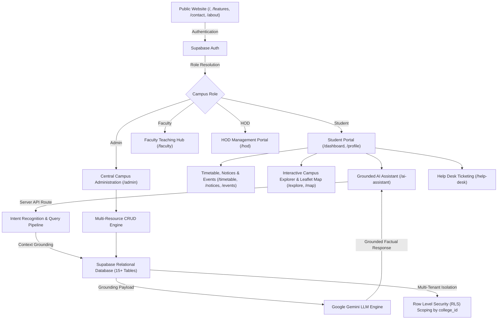

# 🎓 CampusLens AI — Smart College Connect Platform

[](https://nextjs.org/)
[](https://www.typescriptlang.org/)
[](https://supabase.com/)
[](https://tailwindcss.com/)
[](https://leafletjs.com/)

**CampusLens AI** is an institutional-grade, multi-role college connect platform built to unify campus operations, academic schedules, geospatial navigation, issue resolution, and AI assistance into a single collaborative workspace.

---

## 🏛️ System Architecture & Multi-Tenant Scoping


```mermaid
graph TD
    A["Public Website (/, /features, /contact, /about)"] -->|Authentication| B["Supabase Auth"]
    B -->|Role Resolution| C{"Campus Role"}
    
    C -->|Student| D["Student Portal (/dashboard, /profile)"]
    C -->|Faculty| E["Faculty Teaching Hub (/faculty)"]
    C -->|HOD| F["HOD Management Portal (/hod)"]
    C -->|Admin| G["Central Campus Administration (/admin)"]
    
    D --> H["Timetable, Notices & Events (/timetable, /notices, /events)"]
    D --> I["Interactive Campus Explorer & Leaflet Map (/explore, /map)"]
    D --> J["Grounded AI Assistant (/ai-assistant)"]
    D --> K["Help Desk Ticketing (/help-desk)"]
    
    J -->|Server API Route| L["Intent Recognition & Query Pipeline"]
    L -->|Context Grounding| M["Supabase Relational Database (15+ Tables)"]
    M -->|Grounding Payload| N["Google Gemini LLM Engine"]
    N -->|Grounded Factual Response| J
    
    G --> O["Multi-Resource CRUD Engine"]
    O --> M
    
    M -->|Multi-Tenant Isolation| P["Row Level Security (RLS) Scoping by college_id"]
```

---

## 🚀 Key Modules & Capabilities

### 1. 🎓 Student Experience & Digital ID
- **Personalized Daily Schedule**: Automatically filtered by student's enrolled department, academic year, and division.
- **Holographic Digital Student ID**: Active status pulse, QR verification badge, institutional barcode, roll number, and enrolled division.
- **One-Tap Quick Actions**: Instant access to classrooms, lecture halls, urgent circulars, and campus facilities.

### 2. 🗺️ Geospatial Campus Navigation
- **Interactive Leaflet Map**: OpenStreetMap tiles with custom SVG category pins (Academic, Labs, Libraries, Auditoriums, Cafeterias, Sports).
- **Smooth Geospatial Fly-To**: Selecting any campus space smoothly flies the map camera to its exact GPS coordinates.
- **Accessibility & Hours Filtering**: Filter for wheelchair-accessible facilities, open-now timings, and building floor breakdowns.

### 3. 🤖 CampusLens AI Assistant
- **Zero-Hallucination Factual Answers**: Student queries about room numbers, exam dates, timetable slots, and faculty office hours are resolved directly from database tables.
- **Multi-Turn Chat Interface**: Conversational history memory, suggested prompt chips, and instant contextual queries.

### 4. 📅 Academics, Notices & Events
- **Full-Spectrum Timetable**: Filter lectures by day of the week, department, year, and division.
- **Priority-Ranked Notices**: Urgent administrative announcements, departmental advisories, and exam alerts.
- **Campus Events Calendar**: Live calendar of technical fests, hackathons, and guest lectures with venue links.

### 5. 🎫 Multi-Tier Student Help Desk
- **Categorized Ticket Generation**: Submit tickets for IT & Network, RFID Systems, Lab Hardware, Examinations, or Hostel Amenities.
- **Status Progression Lifecycle**: `Submitted` ➔ `Under Review` ➔ `In Progress` ➔ `Resolved`.
- **Administrative Conversation Thread**: Back-and-forth resolution dialogue between student and administrative coordinators.

### 6. 👨‍🏫 Faculty Hub & HOD Analytics
- **Dual-Mode Teaching Hub**: Real-time view of today's assigned lectures and one-click circular publishing.
- **Department Leadership (HOD)**: Department health indicators, faculty workload distributions, student intake metrics, and syllabus tracking.

### 7. 🛡️ Central Campus Administration
- **10-Domain CRUD Engine**: Create, read, update, and manage records for Students, Faculty, HODs, Departments, Locations, Timetable, Notices, Events, Facilities, and Help Desk.
- **Real-Time Telemetry Cards**: Overview of total enrolled scholars, active instructors, spaces mapped, and pending tickets.

### 8. ⚡ Productivity & Power Features
- **Global Command Palette (`⌘K` / `Ctrl+K`)**: Instant fuzzy search across lecture rooms, faculty directories, events, and navigation links.
- **Universal Bookmarks (`/bookmarks`)**: Save frequently visited locations, important exam circulars, and faculty contacts.
- **Real-Time Notification Bell**: Unread indicator and quick-action notification feed.

### 9. ⚡ Real-Time Websockets & Emergency Broadcasts (Phase 16)
- **Supabase Realtime Channel & Cross-Tab Bus**: Subscriptions across `help_request_replies`, `notices`, and `notifications` with `BroadcastChannel` local event bus fallback.
- **Campus Emergency Broadcast Banner**: Critical, warning, and informational institutional alerts with animated pulse cues and dismissibility.
- **Web Audio API Synthesized Chimes**: Built-in dual-tone audio alert cues without external sound assets and user mute/unmute control.
- **Live Ticket Messaging Thread**: Instant message synchronization and built-in staff technician reply simulator.
- **Administrative Incident Dispatcher**: 1-click preset incident templates for severe weather, electrical maintenance, or tech fests.

### 10. 📱 Progressive Web App (PWA) & Offline Capabilities
- **Installable Web App**: Standard Manifest V3 schema (`/manifest.json`) with app shortcuts and standalone display mode.
- **Service Worker Cache**: Offline-first caching for dashboard, navigation shell, and core application assets.

### 11. 📚 Smart Digital Library & Knowledge Commons (Phase 22)
- **150,000+ Volume Search**: Search book catalog by title, author, ISBN, call number, and shelf location.
- **1-Click Loan Extension**: Instant 14-day renewal with maximum 2-cycle quota enforcement.
- **Overdue Fine Engine**: Daily calculation (₹5/day) and automatic standing assessment for examination admittance.
- **Voucher QR Passes**: Verifiable circulation and hold codes (`CL-LIB-BRW-2026-XXXX` & `CL-LIB-RES-2026-XXXX`).
- **Institutional E-Resources**: Integrated repository for IEEE transactions, ACM proceedings, and open access monographs.

### 12. 🏠 Smart Campus Hostel, Residence & Mess Management (Phase 23)
- **Room Allotment & Bed Allocation**: Live occupancy tracking across Boys, Girls, and International scholar residential halls.
- **Dining Schedules & Meal QR Tokens**: 7-day nutritional rotation with calories, allergen tagging, and instant QR meal tokens (`CL-HST-MESS-2026-XXXX`).
- **Verified Night Out-Passes**: Digital gate-pass workflow with mandatory parent telephonic verification and warden sign-offs (`CL-HST-PASS-2026-XXXX`).
- **Rapid Maintenance Ticketing**: SLA-governed resolution tracking for electrical, plumbing, carpentry, and campus LAN grievances.

### 13. 🏥 Campus Health Center, Infirmary & Emergency SOS (Phase 24)
- **1-Tap Emergency Health SOS**: Instantaneous emergency beacon with campus GPS dispatching the campus ambulance and oxygen paramedic squad.
- **Doctor OPD Consultations**: Schedule appointments with Chief Medical Officer, sports physiotherapist, and mental wellness counselors.
- **Complimentary Pharmacy Dispensary**: Real-time stock transparency for over-the-counter essentials, ORS sachets, and prescribed medicines.
- **Medical Sick Leave Attendance Waivers**: Automatic academic attendance percentage adjustment excusing verified sick leave hours.

### 14. 🏆 Student Clubs, Societies & Activity Merit Ledger (Phase 25)
- **Flagship Societies Directory**: Explore Coding & AI, Robotics, Dramatic Arts, Literary Debate, and Social Impact cells.
- **Digital Event Admittance Passes**: Generate and scan high-resolution QR tickets for hackathons, symposiums, and cultural fests (`CL-CLB-TKT-2026-XXXX`).
- **Co-Curricular Merit Ledger**: Verified honors credit score tracking toward Graduation Honors Degrees and academic transcript verification.

### 15. 🎓 Alumni Network, Mentorship Nexus & Endowment Giving (Phase 26)
- **Global Alumni Directory**: Search 1,420+ distinguished alumni across Google DeepMind, Stripe, and NVIDIA by batch, industry, and city.
- **1-on-1 Mentorship Booking**: Schedule 45-minute virtual guidance sessions for CV critiques, technical mock interviews, and graduate school advice.
- **Fast-Track Job Referrals**: Direct alumni-sponsored corporate recruitment postings with verifiable referral codes (`REF-XXXX-XXXX`).
- **Institutional Endowment Campaigns**: Tax-exempt giving ledgers for STEM scholarships, robotics maker labs, and emergency student hardship funds.
- **Lifelong Digital Alumni Pass**: High-resolution holographic pass with QR gate authorization (`CL-ALUM-PASS-2026-XXXX`).

### 16. ⚡ Smart Campus Transport, EV Shuttle Fleet & Digital Parking (Phase 27)
- **Live EV Shuttle Radar**: Real-time GPS tracking and dynamic ETA countdowns across Green Horizon Circular and Night Transit loops.
- **Contactless Bus Boarding Passes**: Digital semester passes with cryptographic QR tokens (`CL-TRN-PASS-2026-XXXX`).
- **Smart Parking Bay Sensors**: Real-time bay occupancy metrics across Faculty, Scholar, and High-Speed EV Rapid charging plazas.
- **Campus Carpooling Community**: Peer commuter matching between city hubs and campus gates with carbon offset tracking.

### 17. 🔬 Research Publications, Innovation Grants & IPR Hub (Phase 28)
- **Peer-Reviewed Publications Repository**: Indexed publications across Scopus, IEEE Xplore, and Nature with instant BibTeX and citation copy tools.
- **Sponsored Grants Outlay Ledger**: Multi-crore research project funding tracking across DST, SERB, and ISRO with tranche milestones.
- **Intellectual Property (IPR) Registry**: Official patent and industrial design filing pipeline with institutional numbers (`CL-IPR-PAT-2026-XXXX`).
- **Deep-Tech Incubation Showcase**: Student and faculty venture portfolio with funding stages, seed grant disbursements, and pitch decks.

### 18. 🌍 International Scholars, Exchange Programs & Global Mobility (Phase 29)
- **Global Partner Universities Directory**: Bilateral exchange opportunities across top QS/THE institutions (ETH Zürich, NUS Singapore, TU Munich, University of Edinburgh).
- **International Scholarships & Fellowships**: Dedicated funding application portal for European Erasmus+, Swiss NSF, and DAAD research grants.
- **Academic Credit Transfer & Course Equivalency**: Course curriculum evaluation ledger mapping foreign ECTS/credits toward domestic degree graduation requirements.
- **Verifiable Travel Clearance Passes**: Cryptographic QR voucher departure passes authorized by the Dean of International Affairs (`CL-GLB-CLR-2026-XXXX`).

### 19. 🌱 Smart Campus Sustainability, Green Energy & Microgrid Telemetry (Phase 30)
- **Live Rooftop Solar PV Telemetry**: Real-time kilowatt generation metrics across Academic Blocks, Central Library, and Sports Arena with microgrid battery storage tracking.
- **Smart Campus Water Conservation**: Rainwater harvesting tank capacities, quality index (pH/TDS), and recycled greywater reclamation volumes.
- **Solid Waste & Cafeteria Composting Audits**: Zero-waste campus metrics, cafeteria organic compost tonnage, and landfill diversion rates (>90%).
- **Student Green Commute Leaderboard**: Carbon offset calculator for cycling, walking, and EV shuttle transit with verifiable Eco-Warrior certificates (`CL-ECO-CRD-2026-XXXX`).

### 20. ⚖️ Campus Grievance Redressal, Anti-Ragging & Student Ombudsman (Phase 31)
- **Statutory UGC/AICTE Grievance Ombudsman**: Independent tribunal presided over by Retired District Judge oversight with binding resolution orders (`CL-GRV-ORD-2026-XXXX`).
- **24/7 Anti-Ragging Emergency Squad**: 1-tap rapid response panic beacon dispatching Chief Proctor and security night patrol squad with 3-minute campus ETA.
- **Zero-Knowledge Anonymous Whistleblower Portal**: Statutorily protected confidential reporting with cryptographic tracking hashes (`ZKP-CASE-2026-XXXX`).
- **Institutional 72-Hour Resolution SLA**: Live countdown tracking with multi-tier escalation matrix and in-camera recorded hearings docket.

### 21. 🏆 Smart Campus Sports Arena, Athletic Leagues & Gym Facilities (Phase 32)
- **Olympic Synthetic Arenas & Court Reservations**: BWF-approved vinyl badminton courts, FIBA hardwood basketball arenas, and floodlit night turf reservations with cryptographic pass vouchers (`RES-COURT-2026-XXXX`).
- **Varsity Leagues & Inter-Department Tournaments**: Real-time fixture brackets, team roster registrations, and championship prize pool ledgers.
- **Biometric Turnstile Gym Passes**: NSNIS coach allocations, body composition index logs, and verifiable QR turnstile fitness passes (`CL-GYM-PASS-2026-XXXX`).
- **Sports Equipment Loan Desk**: Automated gear checkouts for carbon rackets and match footballs with automated deposit refund tracking.

### 22. 🚀 Campus Incubation, Startup Accelerator & Maker Space (Phase 33)
- **Deep-Tech Venture Foundry**: Student and faculty-led startup directory across AI, ClimateTech, BioTech, and Robotics with seed grant allocations.
- **Milestone-Audited Seed Funding Tranches**: Escrow-backed grant disbursements released upon technical peer review by the Incubation Review Board.
- **Rapid Prototyping Maker Space**: High-precision 3D industrial printing (Stratasys), CNC milling, and laser cutter workbench slot scheduling (`MS-SLOT-2026-XXXX`).
- **Angel & VC Demo Day Dockets**: Quarterly investor pitch presentations with formal term sheet deliberation registries (`PITCH-DEMO-2026-XXXX`).

### 23. 🛡️ Smart Campus Security, Visitor Passes & AI Lost & Found (Phase 34)
- **Digital Visitor Pre-Registration**: Cryptographic QR gate departure & entry passes with host faculty verification (`GATE-PASS-2026-XXXX`).
- **RFID Speedlane Turnstile Telemetry**: Real-time tap telemetry stream with automated anti-passback and tailgating anomaly flags.
- **AI Lost & Found Property Repository**: Machine-learning perceptual item matching with secure counter verification claims (`LNF-APEX-2026-XXXX`).
- **24x7 Security Guard Patrol Telemetry**: Encrypted NFC checkpoint verification covering campus perimeter walls and hostel quads.

### 24. 🍲 Smart Campus Cafeteria, Dining Wallets & Contactless Ordering (Phase 35)
- **Multi-Cuisine Campus Food Court**: Real-time kitchen status, stall ratings, and prep time telemetry across North Indian, South Indian, Italian, and Healthy Bowls.
- **Digital Student Dining Wallet**: Instant balance recharge, monthly institutional meal subsidies, and automated low-balance safeguards.
- **Contactless Pre-Order & Token Engine**: Express pickup slot scheduler and cryptographic meal collection vouchers (`TOKEN-XXXXXX` / `CL-DINE-2026-XXXX`).
- **Dietary & Nutritional Transparency**: Calorie metrics, allergen warnings, and pure-veg / vegan / Jain option tagging.

### 25. 🎭 Smart Campus Auditorium, Convention Center & Event Ticketing (Phase 36)
- **Grand Auditorium & Amphitheater Venues**: Seating capacity allocation, Dolby Atmos acoustics, and 4K digital projection stage management.
- **Stage Reservation Engine**: Interactive booking dockets for hackathon keynotes, symposia, and inter-collegiate cultural festivals (`RES-AUD-2026-XXXX`).
- **Cryptographic Event Admittance Passes**: Tiered seating allocation (Orchestra, Balcony, VIP Dignitary) with digital QR verification (`CL-AUD-PASS-2026-XXXX`).
- **AV Stage Equipment Riders**: Automated dispatch for Shure wireless lapel microphones, Behringer digital mixers, and JBL line arrays with sound engineer assignment.

### 26. 🎓 Smart Campus Scholarships, Financial Aid & Merit Endowment Ledger (Phase 37)
- **Merit & Need-Based Scholarship Directory**: Institutional gold fellowships, Google DeepMind STEM grants, corporate CSR waivers, and alumni endowments.
- **Transparent Eligibility Evaluation**: Cumulative CGPA thresholds, family income ceilings, and digital statement-of-purpose submissions (`SCHOL-APP-2026-XXXX`).
- **Direct Benefit Transfer (DBT) Escrow Ledger**: Tranche disbursement tracking with bank UTR settlement numbers and escrow processing status (`DBT-TRN-2026-XXXX`).
- **Verifiable Cryptographic Award Certificates**: Tamper-proof institutional honor certificates signed by the Dean of Academic Welfare (`CL-SCHOL-CERT-2026-XXXX`).

### 27. 📜 Smart Campus Digital Credentialing, Academic Convocation & Verifiable Degree Ledger (Phase 38)
- **Verifiable Digital Degree Registry**: Cryptographically signed degrees, diplomas, and gold medal honors citations with SHA-256 integrity hashes (`CL-DEG-2026-XXXX`).
- **Annual Convocation Ceremony Desk**: Chief Guest dockets, stage processional order, and grand auditorium seating allocations.
- **Academic Regalia & Gown Reservations**: Robe size allocations (`Small`, `Medium`, `Large`, `XL`), family guest passes, and QR admittance passes (`CL-CONV-PASS-2026-XXXX`).
- **Instant Employer Verification Gateway**: Automated background check validation API for enterprise talent acquisition and global graduate admissions (`VERIFY-DEG-XXXX`).

### 28. 🗳️ Smart Campus Student Elections, E-Voting & Campus Democracy Portal (Phase 39)
- **Gymkhana Student Council Directory**: Executive posts (President, Vice-President, General Secretary Cultural, Sports, Tech) with candidate vision statements.
- **Zero-Knowledge Anonymous E-Voting**: Cryptographically blinded ballot tokens guaranteeing complete voter privacy while preventing double voting (`CL-VOTE-2026-XXXX`).
- **Live Voter Turnout Telemetry**: Department-wise polling percentage counters, hourly turnout velocity, and active polling station metrics.
- **Certified Electoral Mandate Ledger**: Automated tallying, certified victory declaration certificates, and tamper-evident election audit trail (`CL-ELEC-CERT-2026-XXXX`).

### 29. 🖨️ Smart Campus Cloud Printing, Document Xerox & Thesis Binding Hub (Phase 40)
- **Distributed Cloud Print Spooler**: Secure print job transmission across Central Knowledge Library, Computing Complex, and Hostel night hubs (`CL-PRINT-2026-XXXX`).
- **Student Print Quota & Credit Ledger**: 500 free semester pages allocation with duplex / color balancing and instant UPI wallet recharges.
- **Hardcover Thesis & Dissertation Binding**: Institutional gold-foil spine embossing, hardcover archival finishes, and departmental HOD sign-off dockets (`CL-THESIS-2026-XXXX`).
- **Contactless Kiosk Release Security**: Encrypted 6-digit release PINs and scan-to-print QR tokens preventing unattended document exposure.

### 30. 🧠 Smart Campus Mental Health, Psychological Counseling & Peer Support Sanctuary (Phase 41)
- **Confidential 1-on-1 Psychological Tele-Therapy**: Private appointments with licensed clinical psychologists (Ph.D./MD) specializing in CBT, stress reduction, and academic performance (`CL-WELL-2026-XXXX`).
- **Anonymous Peer Support Circles**: Peer-facilitated mutual aid groups covering exam burnout, tech imposter syndrome, and hostel transitions with identity blinding.
- **Daily Emotional Pulse & Coping Guidance**: 1-to-5 emotional battery tracking with sleep metrics, stress trigger tags, and tailored mindfulness micro-exercises.
- **24x7 Campus & National Emergency Crisis Lifelines**: Instant round-the-clock telephone and on-campus counselor response connecting to Tele-MANAS, KIRAN, and Apex SOS.

### 31. 🎓 Smart Campus Admissions, Program Applications & Merit Counseling Gateway (Phase 42)
- **Academic Programs Directory & AICTE/UGC Intake Matrix**: Accredited B.Tech, M.Tech, MBA, and Ph.D. degrees with entrance cutoffs (JEE/GATE/CAT), annual tuition, and duration metrics.
- **Prospective Student Application Pipeline**: End-to-end online registrations with verifiable application tracking tokens (`CL-ADM-APP-2026-XXXX`) and quota categories.
- **Merit Seat Allotment & Counseling Dockets**: Centralized counseling rounds (Round 1, Round 2, Spot Mop-Up) with verifiable seat allotment tokens (`CL-ADM-SEAT-2026-XXXX`) and escrow lock workflows.
- **Campus Welcome Tours & Admissions Counselor Desks**: Guided 1-on-1 consultations with Deanery and in-person or virtual 360 tour scheduling (`CL-ADM-TOUR-2026-XXXX`).

### 32. 👨‍👩‍👧 Smart Campus Parent & Guardian Connect, Ward Telemetry & Proctor Gateway (Phase 43)
- **Ward Academic & Attendance Telemetry**: Live semester attendance tracking, exam CGPA grade reports, and statutory 75% minimum threshold alerts with course-by-course breakdowns.
- **Hostel Out-Pass Parent Authorization**: Verifiable one-tap digital guardian consent for overnight hostel leave and weekend out-passes with cryptographic tokens (`CL-PAR-PASS-2026-XXXX`).
- **Parent-Teacher Meeting (PTM) & Proctor Appointment Scheduler**: Reserve 1-on-1 virtual or in-person consultation slots with departmental proctors and faculty mentors (`CL-PTM-SLOT-2026-XXXX`).
- **Institutional Administrative Advisories & Fee Accounts**: Official circulars, semester exam admittance standing, and direct secure messaging channel to the student's designated faculty proctor.

### 33. 🎓 Smart Campus Teaching Assistantships, Graduate Fellowships & Work-Study Ledger (Phase 44)
- **Departmental Fellowship & TA/RA Openings**: Course-linked Teaching Assistantships (CS201, ECE304), Deep Learning Research Fellowships, Central Library Work-Study, and Additive Prototyping Maker Space proctorships with monthly stipend allocations (₹10,000–₹22,000/mo).
- **Scholar Application & Candidate Vetting**: End-to-end applications with statement of purpose, prerequisite grade verification, and verifiable tracking tokens (`CL-FEL-APP-2026-XXXX`).
- **Weekly Duty Timesheet & Supervisor Sign-Off**: Mandatory weekly log submissions for laboratory supervision, tutorial recitations, and assessment grading with faculty approval workflows.
- **Direct Benefit Transfer (DBT) Stipend Payroll**: Bank-integrated escrow ledger with UTR settlement codes (`UTR-2026XXXX-APEX-XXXXX`) and cryptographic voucher tokens (`CL-STIP-2026-XXXX`).
- **Holographic Appointment Passes**: Deanery-authorized appointment credentials with dynamic QR verification (`CL-FEL-APPT-2026-XXXX`) granting Tier-1 server cluster and 24/7 laboratory access.

---

## 🛠️ Technology Stack

| Layer | Technologies |
|---|---|
| **Framework** | Next.js 16 (App Router, Turbopack, Server & Client Components) |
| **Language** | TypeScript 5 (Strict Mode, End-to-End Type Safety) |
| **Styling** | Tailwind CSS v4, Lucide Icons, Glassmorphism UI tokens |
| **UI Components** | shadcn/ui (Radix Primitives, Sheet, Dialog, Card, Badge, Button) |
| **Database & Auth** | Supabase (PostgreSQL 15+, Row-Level Security, Auth Cookies) |
| **Geospatial** | Leaflet, React-Leaflet, OpenStreetMap Cartography |
| **AI Intelligence** | Google Gemini Generative AI, Intent Recognition Pipeline |

---

## 🗄️ Database Architecture

The system utilizes 15 relational tables scoped to `college_id` for multi-college tenant isolation:

- `colleges`: Multi-campus institutional tenant definitions
- `profiles`: Role-based user profiles (`student`, `faculty`, `hod`, `admin`)
- `departments`: Academic faculties, codes, HOD references, and intake capacities
- `faculty`: Academic designations, department mappings, office locations, and emails
- `locations`: Physical campus spaces with latitude, longitude, building, floor, category, and amenities
- `timetable`: Weekly lecture blocks mapped to departments, rooms, faculty, and academic divisions
- `notices`: Institutional and departmental notices with urgency ranking (`normal`, `important`, `urgent`)
- `events`: College conferences, cultural festivals, and seminars
- `facilities`: Campus amenities (Wi-Fi, cafeteria, study pods, sports arenas)
- `help_requests`: Multi-tier support tickets with priority and resolution tracking
- `help_request_messages`: Threaded conversation messages for ticket resolution
- `notifications`: User notification delivery ledger with read/unread flags
- `bookmarks`: Saved user entities (locations, notices, faculty)
- `ai_conversations`: Multi-turn conversational sessions
- `ai_messages`: User prompts and grounded model responses

---

## ⚙️ Local Setup & Development

### 1. Prerequisites
- Node.js 18.17+ or 20+
- npm, pnpm, or bun
- A Supabase project (or local Supabase CLI)

### 2. Clone Repository & Install Dependencies
```bash
git clone https://github.com/ArpitBavankule1/Campus-360.git
cd Campus-360
npm install
```

### 3. Configure Environment Variables
Copy `.env.example` to `.env.local`:
```bash
cp .env.example .env.local
```
Fill in your Supabase credentials and Gemini AI key:
```env
NEXT_PUBLIC_SUPABASE_URL=https://your-project.supabase.co
NEXT_PUBLIC_SUPABASE_ANON_KEY=your-anon-key
SUPABASE_SERVICE_ROLE_KEY=your-service-role-key
AI_API_KEY=your-gemini-or-openai-api-key
```

### 4. Database Migrations & Seed Data
Execute the SQL migrations located in `supabase/migrations/`:
1. `20260921000001_initial_schema.sql` — Schema and table definitions
2. `20260921000002_rls_and_storage.sql` — Row-Level Security policies and storage buckets
3. `20260924000001_campus_data_schema.sql` — Extended campus schema
4. `supabase/seed.sql` — Comprehensive demo dataset for Apex Institute of Technology

### 5. Run Local Development Server
```bash
npm run dev
```
Open [http://localhost:3000](http://localhost:3000) in your browser.

---

## 🧪 Automated Verification Suite

Run our automated verification test suite to validate specific milestone architectures:

```bash
# Phase 13: Command Palette & Bookmarks
node scripts/verify-phase13.mjs

# Phase 14: Public Website & Feature Showcase
node scripts/verify-phase14.mjs

# Phase 15: Master System & Security Audit
node scripts/verify-phase15.mjs

# Phase 16: Real-Time Websockets & Emergency Broadcasts
node scripts/verify-phase16.mjs

# Phase 22: Smart Digital Library & Knowledge Commons
node scripts/verify-phase22.mjs

# Phase 23: Smart Campus Hostel & Residence Management
node scripts/verify-phase23.mjs

# Phase 24: Campus Health Center & Emergency SOS
node scripts/verify-phase24.mjs

# Phase 25: Student Clubs & Activity Merit Ledger
node scripts/verify-phase25.mjs

# Phase 26: Alumni Network & Mentorship Nexus
node scripts/verify-phase26.mjs

# Phase 27: Smart Campus Transport & EV Shuttle Fleet
node scripts/verify-phase27.mjs

# Phase 28: Research Publications, Grants & IPR Hub
node scripts/verify-phase28.mjs

# Phase 29: International Scholars & Global Mobility Hub
node scripts/verify-phase29.mjs

# Phase 30: Smart Campus Sustainability & Green Energy
node scripts/verify-phase30.mjs

# Phase 31: Campus Grievance Redressal & Student Ombudsman
node scripts/verify-phase31.mjs

# Phase 32: Smart Campus Sports Arena, Athletic Leagues & Gym
node scripts/verify-phase32.mjs

# Phase 33: Campus Incubation, Startup Accelerator & Maker Space
node scripts/verify-phase33.mjs

# Phase 34: Smart Campus Security, Visitor Passes & AI Lost & Found
node scripts/verify-phase34.mjs

# Phase 35: Smart Campus Cafeteria, Dining Wallets & Food Ordering
node scripts/verify-phase35.mjs

# Phase 36: Smart Campus Auditorium & Convention Hub
node scripts/verify-phase36.mjs

# Phase 37: Smart Campus Scholarships & Financial Aid
node scripts/verify-phase37.mjs

# Phase 38: Smart Campus Digital Credentialing & Academic Convocation
node scripts/verify-phase38.mjs

# Phase 39: Smart Campus Student Elections & E-Voting
node scripts/verify-phase39.mjs

# Phase 40: Smart Campus Cloud Printing & Thesis Binding
node scripts/verify-phase40.mjs

# Phase 41: Smart Campus Mental Health & Psychological Counseling Sanctuary
node scripts/verify-phase41.mjs

# Phase 42: Smart Campus Admissions, Program Applications & Merit Counseling Gateway
node scripts/verify-phase42.mjs

# Phase 43: Smart Campus Parent & Guardian Connect Gateway
node scripts/verify-phase43.mjs

# Phase 44: Smart Campus Teaching Assistantships, Graduate Fellowships & Work-Study Ledger
node scripts/verify-phase44.mjs

# Run production build validation
npm run build
```

---

## 📄 License
This project is licensed under the MIT License — feel free to adapt it for your college or university campus.
